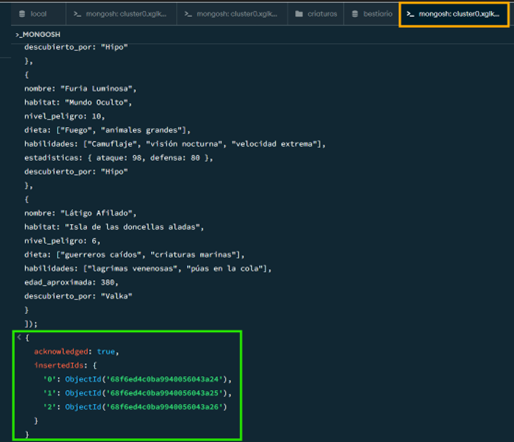
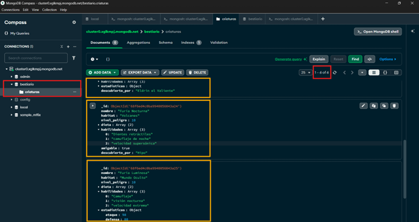

# Misión MongoDB — El Bestiario Digital
**Autora**: Edith Chuico  
**Carrera**: Ingeniería en Tecnologías de la Información  
**Fecha**: 20/Octubre/2025  
### Descripción del Escenario
El Bestiario Digital trata de una colección mágica de criaturas fantásticas con caracteristicas unicas y variables.  
El objetivo con el que se lo realiza es para demostrar la flexibildiad de MongoDB para almacenar información semi-estructruada en dodne cada criatura puede almacenar diferenctes habilidades, esadísticas o comportamientos.  
### Instrucciones para ejecutar misiones_mongodb.js
**1.** Abrir mongo e ir a la consola de MongoDb, para ello se da doble click en el cluster que se está utilizando y se dirije a _Open MongoDB Shell_ y ahí dentro simplemente se ejecuta el código del archivo misiones_mongodb.js  
**2.** Ingreso de datos  
  
**3.** Después de ello se revisan las colecciones agregadas  
  

## Actualización Tarea 3  
Esta mision se enfoca en darle una mayor seguridad a la base de datos **bestiario** , esto con el uso de las reglas de validacion de datos utilziando JSON Schema en MongoDB  
El objetivo es asegurar la informacion y crear relaciones entre las entidades actualizadas **(guardianes y criaturas)** utilizando embebido y referenciado  
**Estructura de .mongodb**  
Para definir los esquemas y probar la validaciones de los datos, se crearon tres archivos:  
*01_definicion_guardianes.mongodb* : En este archivo primero se empieza haciendo una limpieza de la colección, en caso de que existiera, posterior a ello, se define la coleción guardiantes con JSON Schema y se validan los tipos, enum (para imponer los unicos datos que se pueden ingresar), se utilizó tambien una expresion regrex para la contraseña, y se modeló la relación 1 a Muchos para el inventario.  
*02_definicion_criaturas.mongodb* : Al igual que en el anterior, tambein se realizó la limpieza de la colección y posterior se incluyeron las validaciones de arrays y datos, junto con el modelado de la relacion 1 a 1, tambien se cuenta con una función embebida y una relación 1 a Muchos referenciada con el id_guardian  
*03_pruebas_insercion.mongodb* : En este archivo se muestran las sentencias de inserción para demostrar que los esquemas estan funcionando de manera correcta, se inlcuyeron inserciones válidas y fallidas que logran activar los mensajes de validacion anteriormente establecidos  
